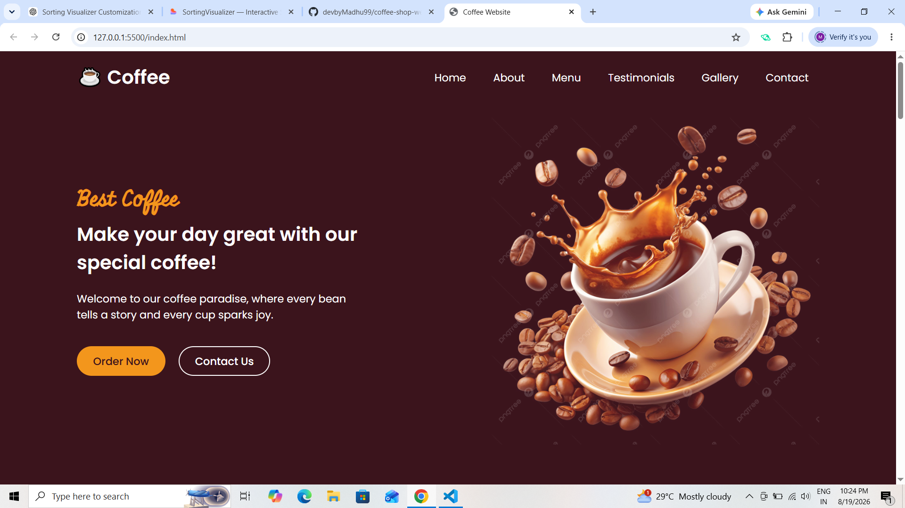
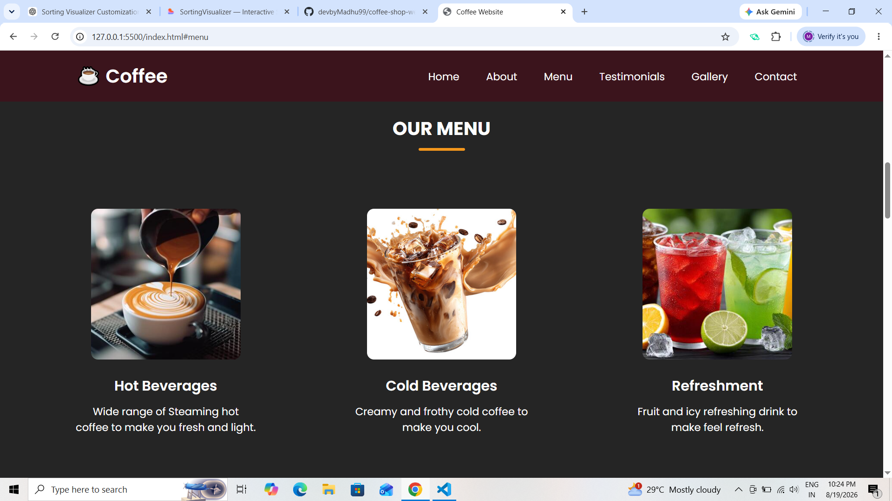
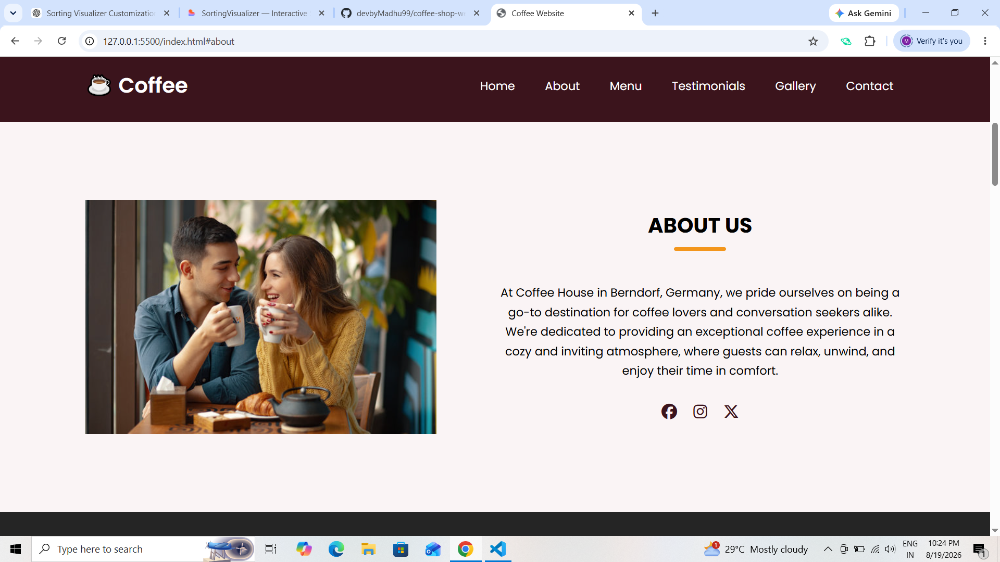
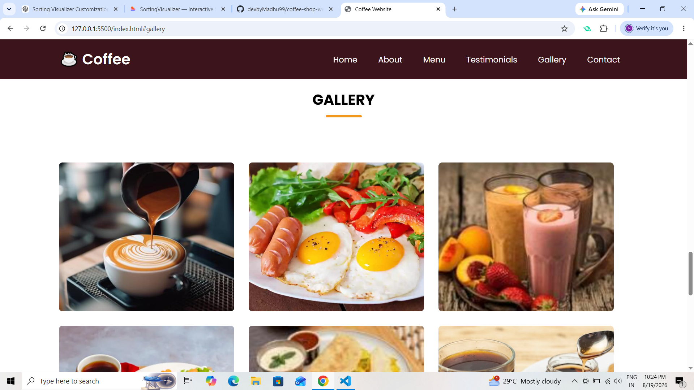
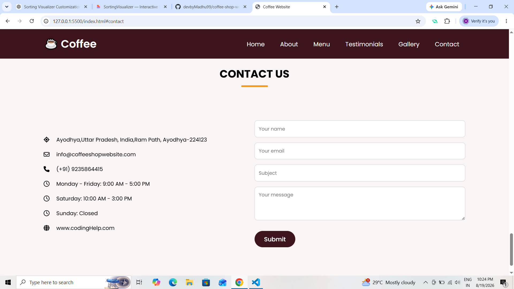

# ☕ Coffee Shop Website

A modern, responsive, and visually appealing coffee shop website built to provide customers with a beautiful online café experience.

The project includes a stylish home page, coffee menu, gallery, testimonials, About Us section, and contact form. It also includes a Spring Boot backend and MySQL database for managing application data.

---

## ✨ Features

- 🏠 Attractive and modern Home page
- ☕ Coffee Menu section
- 🖼️ Coffee Gallery
- ⭐ Customer Testimonials
- 📖 About Us section
- 📩 Contact Form
- 📱 Fully responsive design
- 💻 Desktop, laptop, tablet, and mobile support
- 🎨 Modern UI with smooth styling and transitions
- 🗄️ MySQL database integration
- ⚙️ Spring Boot backend
- 🔗 Frontend and backend API integration
- 📊 Persistent database storage

---

## 📸 Screenshots

### 🏠 Home Page



---

### ☕ Menu



---

### 📖 About Us



---

### 🖼️ Gallery



---

### ⭐ Testimonials


---

### 📩 Contact



---

## 🛠️ Tech Stack

### Frontend

- HTML5
- CSS3
- JavaScript

### Backend

- Java
- Spring Boot
- Spring Data JPA
- REST API
- Maven

### Database

- MySQL

### Development Tools

- VS Code
- IntelliJ IDEA / Eclipse
- Git
- GitHub

---

## 📂 Project Structure

```text
Coffee-Shop-Website/
│
├── Coffee_website/
│   ├── index.html
│   ├── Style.css
│   ├── home.jpg
│   ├── menu1.jpg
│   ├── menu2.jpg
│   ├── menu3.jpg
│   ├── menu4.jpg
│   ├── menu5.jpg
│   ├── menu6.jpg
│   ├── gallery1.jpg
│   ├── gallery2.jpg
│   ├── gallery3.jpg
│   ├── gallery4.jpg
│   ├── gallery5.jpg
│   ├── gallery6.jpg
│   └── ...
│
├── coffee-shop-backend/
│   └── coffee-shop-backend/
│       ├── src/
│       ├── pom.xml
│       ├── mvnw
│       ├── mvnw.cmd
│       └── Dockerfile
│
├── screenshots/
│   ├── home.png
│   ├── menu.png
│   ├── about.png
│   ├── gallery.png
│   ├── testimonials.png
│   └── contact.png
│
└── README.md
